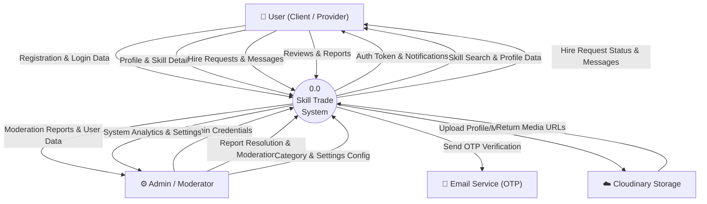
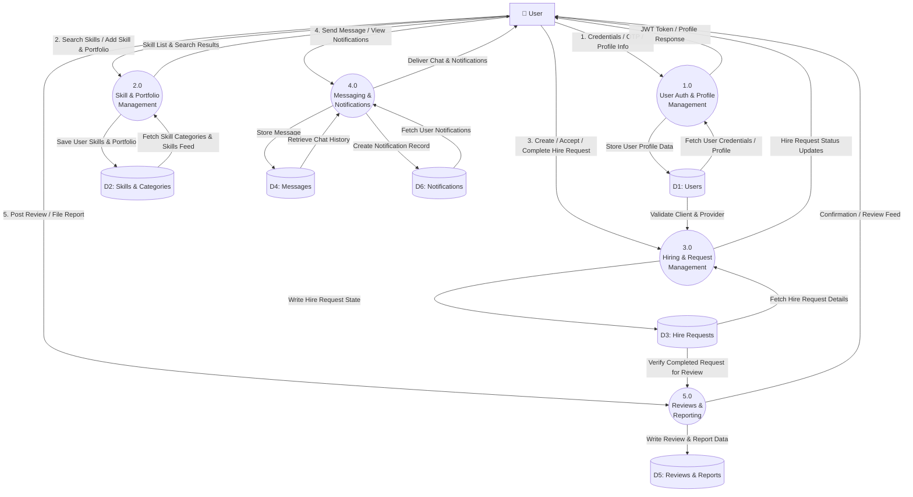
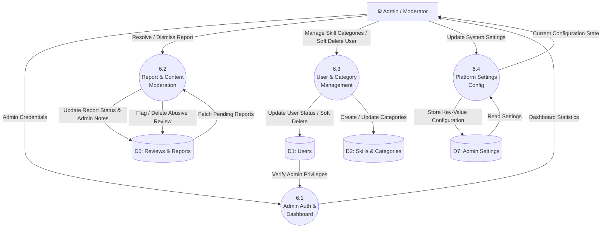

# Data Flow Diagrams (DFD) - Skill Trade

This document provides the complete Data Flow Diagram (DFD) specifications for the **Skill Trade** project, structured into **Level 0 (Context Diagram)**, **Level 1 (User & Core System Processes)**, and **Level 2 (Admin Moderation Processes)**.

---

## 1. DFD Level 0 (Context Diagram)

The **Level 0 Context Diagram** provides a high-level overview of the **Skill Trade System**, detailing external entities (User, Admin, Email Service, Cloudinary Storage) and the fundamental data flows into and out of the system.

### Data Flow Descriptions (Level 0)

* **User Input**: Registration credentials, OTP verification codes, profile details, skills offered, hire requests, chat messages, ratings/reviews, content reports, bookmarks.
* **System Output to User**: JWT authentication tokens, search results, hire request status updates, real-time messages, in-app notifications, peer feedback.
* **Admin Input**: Login credentials, report resolution actions, category updates, user moderation flags, global platform settings.
* **System Output to Admin**: Pending moderation reports, platform analytics, system logs, user management lists.
* **External Systems**:
  * **Email Service**: Handles delivery of email OTP codes for user verification.
  * **Cloudinary**: Handles cloud-based storage for images (profile pictures, portfolio items, certificate proofs, review screenshots).

---

## 2. DFD Level 1 (User & Core System Processes)

The **Level 1 DFD** breaks down the central system into core functional processes and illustrates interactions with the primary database stores (`D1` through `D6`).

---

## 3. DFD Level 2 (Admin Moderation & Panel Processes)

The **Level 2 DFD** decomposes administrative control and moderation operations (Process `6.0`), showing how platform administrators inspect reports, moderate content, manage skill categories, and configure application settings.

---

## 4. Data Store Mapping Summary

| Data Store ID | Data Store Name | Description | Related Database Tables |
| :--- | :--- | :--- | :--- |
| **D1** | Users Store | Stores account credentials, profile details, availability, and verification metrics. | `users` |
| **D2** | Skills & Categories Store | Contains skill categories, master skills, individual user skill offerings, and portfolio items. | `categories`, `skills`, `user_skills`, `portfolio`, `experiences`, `education`, `certificates` |
| **D3** | Hire Requests Store | Manages contracts and status transitions (Pending, Accepted, Completed, Rejected, Cancelled). | `hire_requests` |
| **D4** | Messages Store | Stores 1:1 chat conversations between clients and providers. | `messages` |
| **D5** | Reviews & Reports Store | Manages peer feedback ratings, comments, and submitted moderation reports. | `reviews`, `reports` |
| **D6** | Notifications Store | Stores in-app user notifications and bookmarked profile links. | `notifications`, `bookmarks` |
| **D7** | Admin Settings Store | Key-value store for platform-wide options and administrative parameters. | `admin_settings` |
